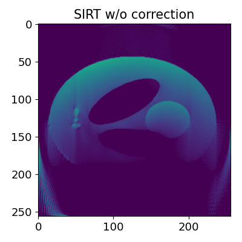
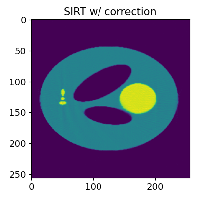
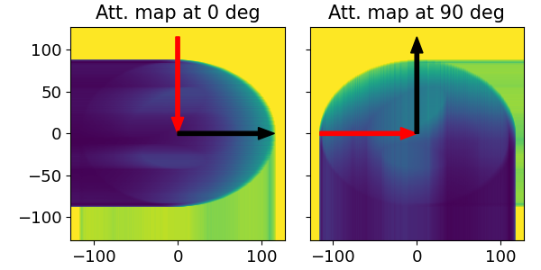

# Attenuation correction

In this tutorial, we show how to use `corrct`'s attenuation correction functions.
We first create a synthetic test case, as the one presented in:

- N. Viganò and V. A. Solé, “Physically corrected forward operators for
induced emission tomography: a simulation study,” Meas. Sci. Technol., no.
Advanced X-Ray Tomography, pp. 1-26, Nov. 2017.

### Synthetic data creation

We can create the phantom and the local attenuation coefficient maps for the
incoming beam and emitted photon energies with the following code:
```Python
try:
    import phantom
except ImportError:
    cct.testing.download_phantom()
    import phantom

vol_shape = [256, 256, 3]

ph_or = np.squeeze(phantom.modified_shepp_logan(vol_shape).astype(np.float32))
ph_or = ph_or[:, :, 1]

ph, vol_att_in, vol_att_out = cct.testing.phantom_assign_concentration(ph_or)
```
These are the resulting images:


We then create a sinogram with the following function:
```Python
sino, angles_rad, expected_ph, _ = cct.testing.create_sino(ph, 120, vol_att_in=vol_att_in, vol_att_out=vol_att_out, psf=None)
```

The resulting sinogram will show strong attenuation effects on the side that is
the most far away from the XRF detector. Here below is a comparison against a
non-attenuated sinogram.


### Reconstruction

When proceeding to reconstruct with an uncorrected project as the following:
```Python
solver_sirt = cct.solvers.SIRT(verbose=True)

vol_geom = cct.models.get_vol_geom_from_data(sino)

with cct.projectors.ProjectorUncorrected(vol_geom, angles_rad) as p:
    rec_sirt_uncorr, _ = solver_sirt(p, sino, iterations=250, lower_limit=0.0)
```
We obtain the following reconstruction:



If instead we use a corrected projector with the following code:
```Python
with cct.projectors.ProjectorAttenuationXRF(vol_geom, angles_rad, att_in=vol_att_in, att_out=vol_att_out) as p:
    rec_sirt_corr, _ = solver_sirt(p, sino, iterations=250, lower_limit=0.0)
```
We obtain a corrected reconstruction:



The resulting reconstruction still shows some imperfections, but most of the
aberrations have been corrected.

### What happens behind the scenes

What the project `ProjectorAttenuationXRF` actually does is to compute local
attenuation maps for the pixels at each reconstruction angle.
This can be seen if we use the `AttenuationVolume` directly, instead of letting
the projector call it for us:
```Python
att = cct.physics.attenuation.AttenuationVolume(
    incident_local=vol_att_in, emitted_local=vol_att_out, angles_rot_rad=angles_rad
)
att.compute_maps()
```
Two of the maps computed with the `compute_maps` method are shown here below:

The red arrow indicates the incoming beam direction, while the black arrow
indicates the XRF detector position with respect to the sample.

These maps can then be passed to the projector with the `**att.get_projector_args()` API:
```Python
with cct.projectors.ProjectorAttenuationXRF(ph.shape, angles_rad, **att.get_projector_args()) as p:
    rec_sirt_corr, _ = solver_sirt(p, sino, iterations=250, lower_limit=0.0)
```
