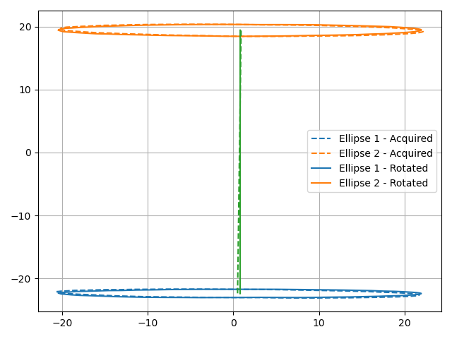
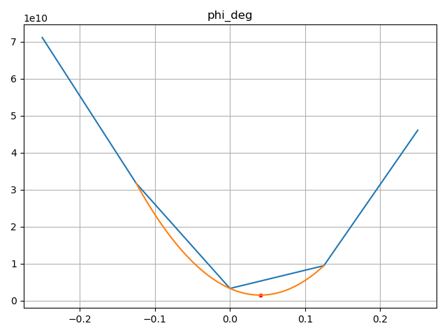
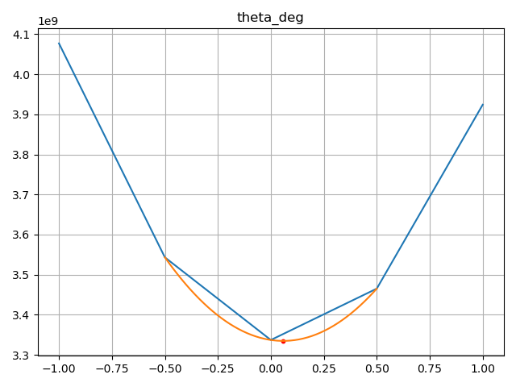
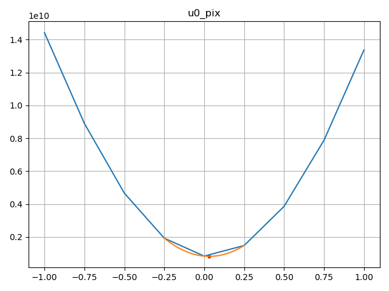
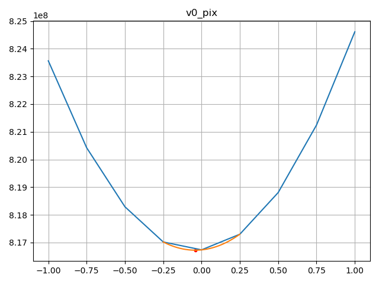
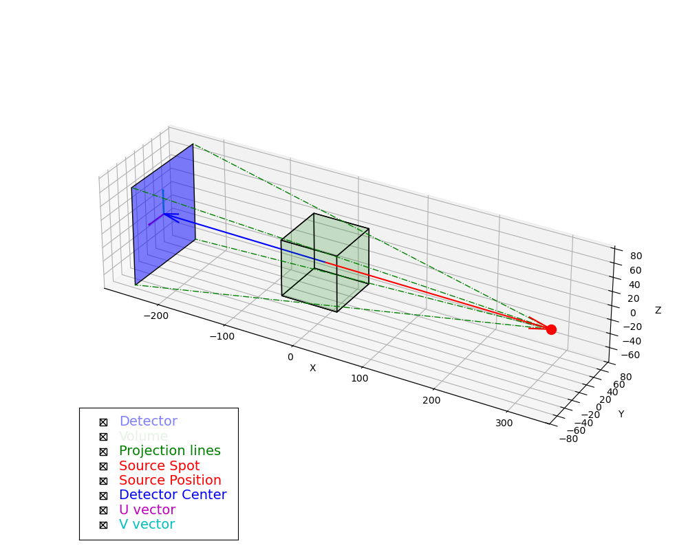

# Cone-Beam Geometry Calibration

In this tutorial, we'll demonstrate how to use `corrct`'s cone-beam geometry calibration routines.
This process is crucial for accurate X-ray tomography reconstructions, especially when dealing with cone-beam geometry setups.
This calibration procedure is based on:

- Noo, F., Clackdoyle, R., Mennessier, C., White, T. A. & Roney, T. J. (2000). Phys. Med. Biol. 45, 3489–3508.
  doi: 10.1088/0031-9155/45/11/327

This procedure relies on certain assumptions of the geometry (e.g., non-degeneracy of certain parameters), and it has
limitations with respect to its accuracy or ability to determine certain parameters (i.e., one of the detector tilts).
More advanced procedures have been published in the literature more recently, which address its pitfalls.
However, it is quite straight-forward to be carried out, and it requires minimal data to work.
The remaining uncertainties can be fine tuned with the data-driven approach presented here below.

In particular, this procedure assumes that you provide two different tomography scans of a rotating marker,
on circular orbits around the rotation axis of the sample coordinates.
Ideally, these two trajectories should be on opposite sides of the origin along the rotation axis (not necessarily at the exact same distance).
The projections of these two orbits will form two distinct ellipses over the detector.

To follow this tutorial, you will need to download the demonstration dataset from [Zenodo](https://doi.org/10.5281/zenodo.20559974), and place it a sub-directory `./data/` of the current working directory.

## Setup and Data Loading

First, let's import the necessary libraries and load our example dataset:

```python
from pathlib import Path
import h5py
import numpy as np
from numpy.typing import NDArray

from corrct.alignment.cone_beam import FitConeBeamGeometry, tune_acquisition_geometry
from corrct.alignment.markers import create_marker_disk, track_marker
from corrct.models import plot_projection_geometry

def _get_data(fid: h5py.File, data_path: str) -> NDArray:
    dataset = fid[data_path]
    if isinstance(dataset, h5py.Dataset):
        return np.array(dataset[()])
    else:
        raise ValueError(f"Path: {data_path}, is not a h5py.Dataset, but a {dataset} instead")

def _load_data(fname: str | Path) -> dict[str, NDArray]:
    with h5py.File(fname) as fid:
        return {k: _get_data(fid, f"/{k}") for k in fid.keys()}

try:
    data = _load_data("./data/calibration_scans.h5")
except FileNotFoundError as exc:
    raise ValueError("Please download the example dataset from https://doi.org/10.5281/zenodo.20559974") from exc
```

This dataset is composed of two different tomographic scans, with 60 angles each. In each scan, we record the motion of a
sphere in a circular orbit at radius of 3 millimeters around the rotation axis of the sample rotation stage.

## Sphere Trajectory Tracking

Before we can proceed with the geometry calibration, we need to identify the sphere position over the detector at each angle.
The sphere trajectory over the detector will be an ellipse, corresponding to the projection of each circular trajectory from the
sample space.

We'll start by creating a marker disk:

```python
prj_size_vu = (data["scan_1"].shape[0], data["scan_1"].shape[2])

probe = create_marker_disk(prj_size_vu, 3.5)
```

:::{note}
   The `create_marker_disk` function is a convenience function for objects that look like projected solid spheres.
   For other types of objects, you might want use one real image of the object (or an average of them).
:::

We can then track its position in our projection images:
```python
pos_l, pos_u = (track_marker(imgs, probe) for imgs in (data["scan_1"], data["scan_2"]))
```

## Initial Geometry Estimation

Next, we'll estimate the initial cone-beam geometry parameters:

```python
pixel_size_um = float(data["pixel_size_um"])
orbit_radius_pix = float(data["orbit_radius_um"]) / pixel_size_um

fit_cb_geom = FitConeBeamGeometry(
    prj_size_vu, points_ell1=pos_u, points_ell2=pos_l, pix_size_um=pixel_size_um, plot_result=True
)
acq_geom = fit_cb_geom.fit(r=orbit_radius_pix)

print(acq_geom)
```

The radius of the circular trajectory should be known and provided in pixels.

:::{note}
   While the attribute `pix_size_um` is optional, we suggest passing it, as it will, as it will enable the fitting routines
   to automatically present the fitted distances in both pixels and micrometers.
:::

If the switch `plot_result` is `True`, this procedure will display the trajectory of the ellipses, both before `eta` fitting and after.



## Geometry Refinement

For more accurate results, it is possible to refine our geometry estimation, by minimizing the residual of the reconstructions:

```python
imgs_t = (data["scan_1"] + data["scan_2"]).astype(np.float32)
angles_rot_rad = np.deg2rad(data["angles_deg"])

acq_geom = tune_acquisition_geometry(
    acq_geom,
    data=imgs_t,
    angles_rot_rad=angles_rot_rad,
    params=dict(
        theta_deg=np.linspace(-1, 1, 5),
        phi_deg=np.linspace(-0.25, 0.25, 5),
        u0_pix=np.linspace(-1, 1, 9),
        v0_pix=np.linspace(-1, 1, 9),
    ),
    verbose=True,
)

print(acq_geom)
```

The `tune_acquisition_geometry` expects an initial geometry, projection data (with corresponding rotation angles in radians), and a dictionary listing for each parameter to be optimized the list of values to try.
It will then return the geometry that has the lowest reconstruction residual for the given values.

::::{grid}
:::{grid-item}

:::
:::{grid-item}

:::
::::
::::{grid}
:::{grid-item}

:::
:::{grid-item}

:::
::::

## Visualization

After completing the calibration, you can visualize the projection geometry:

```python
plot_projection_geometry(acq_geom.get_prj_geom(), acq_geom.get_vol_geom())
```

